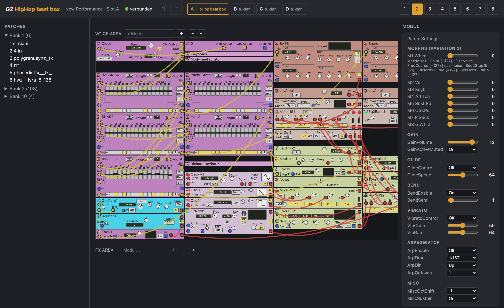

# g2-webeditor

**[English](#english) · [Deutsch](#deutsch)**



---

## English

Web-based patch editor for the Clavia Nord Modular G2. The backend runs on a headless
Linux ARM board (Raspberry Pi, ClockworkPi and similar) with the G2 attached via USB;
the editor is used from any browser on the LAN (PC, Mac, iPad).

```
G2 ──USB──> ARM board: g2lib (Java) + Javalin bridge ──WS/HTTP──> browser SPA
```

**Status:** Phases 1–4 largely complete, every step verified against real hardware.
Graphical patch editor with the original Clavia module layout (knobs, buttons,
formatted value displays), module faces rendered from g2fx UI data; cables
(drag-to-connect), module add/delete/copy/move with collision push-down,
multi-select (rubber band/shift-click) with block move/copy/delete including
internal cables; server-side undo/redo with UI feedback; slots A–D, variations,
patch settings (gain/glide/bend/vibrato/arpeggiator) and morph assignments;
multi-client via WebSocket broadcast. Still open: performance mode, live
LED/VU/graph feedback, patch persistence (.pch2 export).
Details: `docs/phase*-ergebnis.md` (German).

### Layout

- `backend/` — Java 25, Gradle. Javalin: REST + WebSocket + static frontend.
  `G2Service` interface with `MockG2Service` (development without hardware) and
  `G2LibService` (USB adapter on top of g2lib).
- `backend/src/main/java/org/g2fx/` — vendored `g2lib` from
  [sirlensalot/g2fx](https://github.com/sirlensalot/g2fx) @ `e75c6d0` (BSD-3),
  with small local patches (see `docs/phase2-ergebnis.md`, `docs/phase3-ergebnis.md`).
- `frontend/` — TypeScript + Vite, no framework. The build is copied into
  `backend/src/main/resources/public/` → a single deployable.
- `deploy/` — udev rule, systemd unit, install script.
- `docs/` — architecture, JSON protocol (`protocol.md`), phase reports including
  hard-won G2 USB protocol findings.
- `scripts/` — vendor script, WebSocket smoke tests (`ws-smoke.py`, `ws-load-test.py`).

### Quickstart (development, no hardware)

```bash
cd backend && ./gradlew run        # MockG2Service on :8080
cd frontend && npm install && npm run dev
```

### Deployment (short version)

```bash
# on the target board: OpenJDK 25 headless (e.g. apt install openjdk-25-jdk-headless)
cd frontend && npm install && npm run build && cp -r dist/. ../backend/src/main/resources/public/
cd backend && ./gradlew installDist
sudo deploy/install.sh             # udev + systemd service "g2web", port 8080
```

Notes: the G2 needs a clean USB release on shutdown, otherwise it refuses to reconnect —
the systemd unit therefore runs `usbreset` as `ExecStartPre`. Variation select requires
an explicit slot request command (`0x6a`), see `docs/phase3-ergebnis.md`.

### License

BSD-3-Clause (see `LICENSE`). Contains vendored code from
[sirlensalot/g2fx](https://github.com/sirlensalot/g2fx) (BSD-3-Clause,
`backend/src/main/java/org/g2fx/LICENSE-g2fx`). Thanks to sirlensalot for the clean
g2lib/g2gui separation, and to BVerhue (nord_g2_editor) and chrispurusha (G2-Edit)
for the protocol references.

---

## Deutsch

Web-basierter Patch-Editor für den Clavia Nord Modular G2. Das Backend läuft auf einem
headless Linux-ARM-Board (Raspberry Pi, ClockworkPi o.ä.), an dem der G2 per USB hängt;
bedient wird vom Browser aus (PC, Mac, iPad).

```
G2 ──USB──> ARM-Board: g2lib (Java) + Javalin-Bridge ──WS/HTTP──> Browser-SPA
```

**Status:** Phasen 1–4 weitgehend fertig, jeder Schritt gegen echte Hardware
verifiziert. Grafischer Patch-Editor mit dem Original-Modul-Layout von Clavia
(Knobs, Buttons, formatierte Wertanzeigen), Modulflächen aus den g2fx-UI-Daten
gerendert; Kabel (Drag-to-Connect), Modul anlegen/löschen/kopieren/verschieben
mit Kollisions-Push-Down, Multi-Select (Gummiband/Shift-Klick) mit
Block-Verschieben/-Kopieren/-Löschen inkl. interner Kabel; serverseitiges
Undo/Redo mit UI-Feedback; Slots A–D, Variations, Patch-Settings
(Gain/Glide/Bend/Vibrato/Arpeggiator) und Morph-Zuweisungen; LED-/VU-Anzeigen
live vom Gerät (gebündeltes `visuals`-Streaming) und Env-/Filter-Graph-Kurven
(ADSR/ADDSR/ADR/AHD/Multi/D/H, FltClassic); Multi-Client via
WebSocket-Broadcast. Offen: Performance-Mode, restliche GraphFuncs,
Patch-Persistenz (.pch2-Export).
Details: `docs/phase*-ergebnis.md`.

### Struktur

- `backend/` — Java 25, Gradle. Javalin: REST + WebSocket + statisches Frontend.
  `G2Service`-Interface mit `MockG2Service` (Entwicklung ohne Hardware) und
  `G2LibService` (USB-Adapter auf g2lib).
- `backend/src/main/java/org/g2fx/` — vendored `g2lib` aus
  [sirlensalot/g2fx](https://github.com/sirlensalot/g2fx) @ `e75c6d0` (BSD-3),
  mit kleinen lokalen Patches (siehe `docs/phase2-ergebnis.md`, `docs/phase3-ergebnis.md`).
- `frontend/` — TypeScript + Vite, kein Framework. Build wird nach
  `backend/src/main/resources/public/` kopiert → ein Deployable.
- `deploy/` — udev-Regel, systemd-Unit, Installationsskript.
- `docs/` — Architektur, JSON-Protokoll (`protocol.md`), Phasen-Ergebnisse inkl.
  hart erarbeiteter G2-USB-Protokoll-Erkenntnisse.
- `scripts/` — Vendor-Skript, WS-Smoke-Tests (`ws-smoke.py`, `ws-load-test.py`).

### Quickstart (Entwicklung, ohne Hardware)

```bash
cd backend && ./gradlew run        # MockG2Service auf :8080
cd frontend && npm install && npm run dev
```

### Deployment (Kurzfassung)

```bash
# auf dem Zielgerät: OpenJDK 25 headless (z.B. apt install openjdk-25-jdk-headless)
cd frontend && npm install && npm run build && cp -r dist/. ../backend/src/main/resources/public/
cd backend && ./gradlew installDist
sudo deploy/install.sh             # udev + systemd-Service "g2web", Port 8080
```

Hinweise: Der G2 braucht ein sauberes USB-Release beim Beenden, sonst verweigert er die
Wiederverbindung — die systemd-Unit macht deshalb `usbreset` als `ExecStartPre`.
Variation-Select erfordert ein explizites Slot-Request-Kommando (`0x6a`), siehe
`docs/phase3-ergebnis.md`.

### Lizenz

BSD-3-Clause (siehe `LICENSE`). Enthält vendorten Code aus
[sirlensalot/g2fx](https://github.com/sirlensalot/g2fx) (BSD-3-Clause,
`backend/src/main/java/org/g2fx/LICENSE-g2fx`). Dank an sirlensalot für die saubere
Trennung von g2lib/g2gui sowie an BVerhue (nord_g2_editor) und chrispurusha (G2-Edit)
für die Protokoll-Referenzen.
